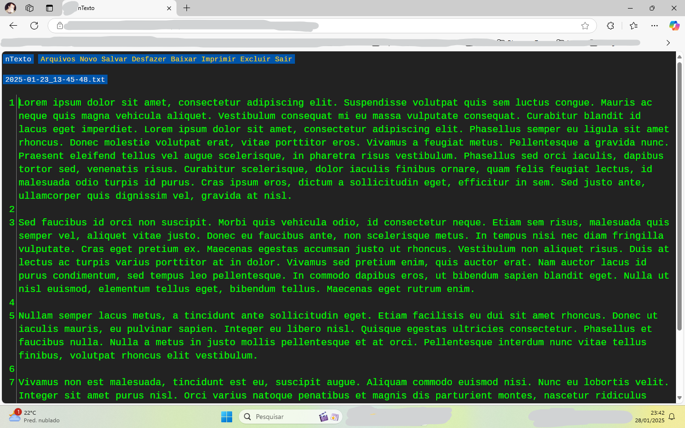

# ntexto
Um pequeno editor de texto feito em php para rodar num servidor web

## Motivo
Eu queria um editor de textos de rascunho na nuvem que funcionasse com qualquer coisa que acesse a internet e tenha um teclado.

## Instalação
Basta copiar para o diretório web do servidor. Altere o login e senha no arquivo 2-check.php.
