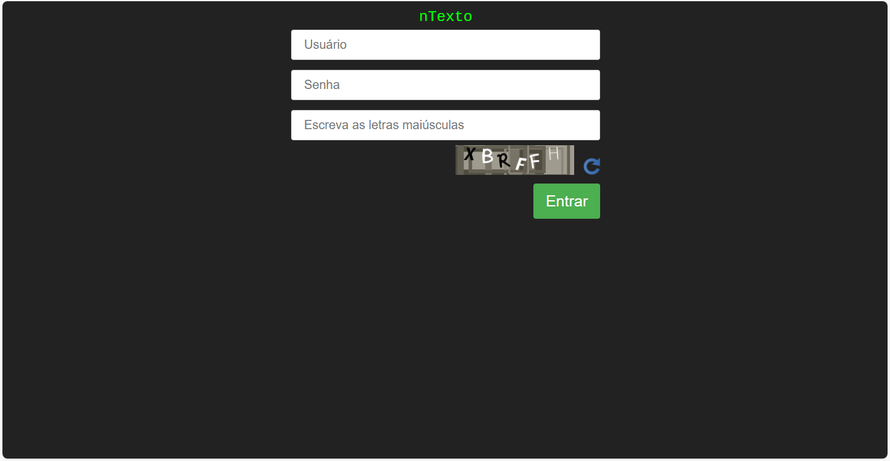
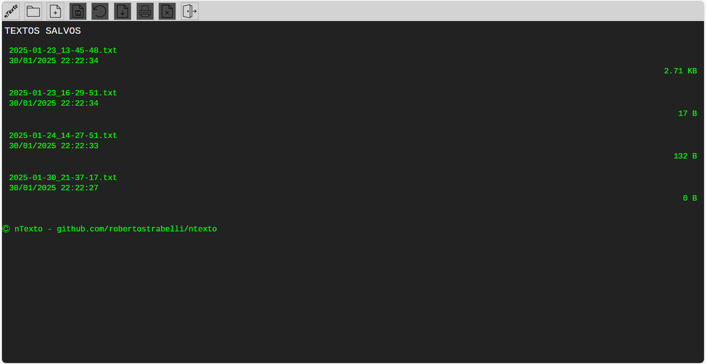
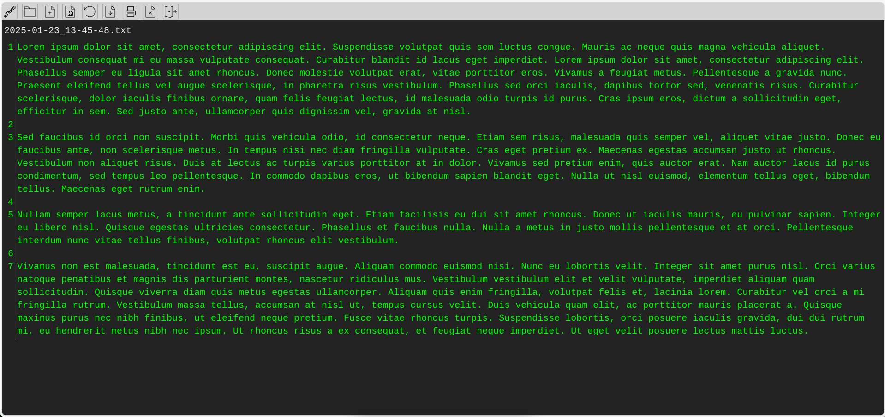

# nTexto
Um pequeno editor de texto puro feito em php para rodar num servidor web.

## Motivo
Eu queria um editor de textos de rascunho na nuvem que funcionasse com qualquer coisa que acessasse a internet.

## Instalação
Basta copiar para o diretório web do servidor. Altere o login e senha no arquivo **2-check.php**. Como a ideia é ter um editor de texto para uso restrito, o **index.html** serve apenas para despistar curiosos que encontrem o diretório. O login é feito na página **entrar.php**.
